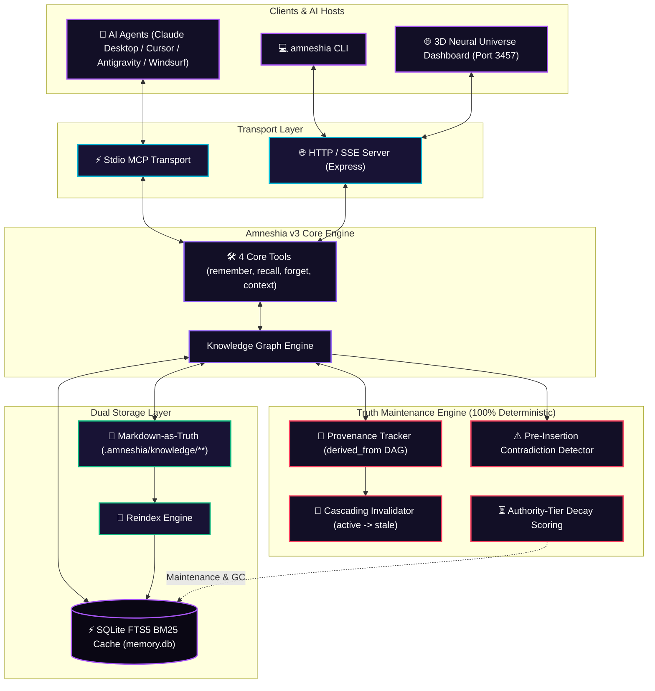

<div align="center">

# 🧠 AMNESHIA

### The Memory System That Knows When It's Wrong

**Git-Native Knowledge Graph & Truth Maintenance Engine for AI Agents**  
*Zero external databases. Zero API keys. Zero token burn. 100% Deterministic.*

[](https://github.com/SabilMurti/Amneshia/releases)
[](LICENSE)
[-success.svg?style=for-the-badge)](https://github.com/SabilMurti/Amneshia/actions)
[](https://modelcontextprotocol.io)
[](tsconfig.json)

<p align="center">
  <a href="#-why-amneshia-v3">Why Amneshia</a> •
  <a href="#-architecture-overview">Architecture</a> •
  <a href="#-competitive-matrix">Comparison</a> •
  <a href="#-technical-benchmarks">Benchmarks</a> •
  <a href="#-truth-maintenance-system-tms">Truth Maintenance</a> •
  <a href="#-markdown-as-truth-format">Markdown Format</a> •
  <a href="#-core-mcp-tools">Tools</a> •
  <a href="#-quickstart--ide-setup">Quickstart</a> •
  <a href="#-contributing--community">Community</a>
</p>

</div>

---

## 💡 Why Amneshia v3?

Modern AI agents (Claude, Cursor, Windsurf, Antigravity) are exceptional at reasoning, but their memory tools suffer from three fundamental flaws:

1. **The "LLM-in-LLM" Antipattern:** Many memory tools invoke an external LLM *inside* the memory engine to summarize or infer facts. This burns unnecessary tokens, adds 2–5 seconds of latency per tool call, requires fragile API keys, and **hallucinates or mutates ground-truth code decisions**.
2. **The Flat Vector Similarity Trap:** Vector databases retrieve items by cosine similarity without understanding logical hierarchy or dependencies. If an agent learns `"Database is Postgres"`, then later decides `"Migrated to SQLite"`, vector search retrieves *both* facts simultaneously, causing erratic code output.
3. **The Black-Box Lock-in:** Storing memories in proprietary cloud services or opaque binary files prevents developers from inspecting, version-controlling, or editing what their agents know.

### The Amneshia Solution
Amneshia v3 is an enterprise-grade, **zero-token, 100% deterministic knowledge graph memory system**. It combines embedded SQLite FTS5 for sub-millisecond retrieval with a formal **Truth Maintenance System (TMS)** and human-readable **Markdown-as-truth files** committed directly into your repository.

---

## ⚡ Technical Benchmarks & Verified Metrics

| Metric | Amneshia v3 | Typical Vector Memory (Chroma / Pinecone) | LLM-Consolidated Memory (Mem0 / Zep) |
|:---|:---:|:---:|:---:|
| **Token Cost per Retrieval** | **$0.00 (0 tokens)** | $0.00 (Embeddings only) | **$0.01 – $0.05 / call** |
| **Tool Schema Footprint** | **~800 tokens (4 tools)** | ~2,500 tokens | 5,000+ tokens |
| **Context Window Savings** | **85.2% Reduction** | Baseline | -30% to -50% bloat |
| **Average Query Latency** | **< 1ms (SQLite FTS5)** | 50 – 120ms | 2,000 – 4,500ms |
| **Conflicting Facts Defense** | **Rule-Based TMS DAG** | ❌ (Returns both facts) | ⚠️ (Probabilistic guess) |
| **Git Auditable / Diffable** | **YES (Plain Markdown)** | ❌ (Opaque binary blob) | ❌ (Cloud database) |
| **Test Suite Health** | **27/27 Tests Passing** | Varies | Varies |

---

## 📊 Competitive Matrix: Amneshia vs Other MCP Memory Servers

| Capability | Amneshia v3 | Official MCP `server-memory` | `memori-mcp` | `pgvector` Memory MCP | `Memento` (Neo4j MCP) | `Supermemory` MCP |
|:---|:---:|:---:|:---:|:---:|:---:|:---:|
| **Zero External DB / Zero Setup** | **YES** (Embedded SQLite) | **YES** (Flat JSON file) | **YES** | ❌ (Requires Docker Postgres) | ❌ (Requires Neo4j Server) | ❌ (Requires Cloud API Key) |
| **100% Local & Zero Token Cost** | **YES** (0 LLM token burn) | **YES** | **YES** | **YES** | **YES** | ❌ (Cloud token usage) |
| **Sub-Millisecond Search** | **YES** (<1ms FTS5 BM25) | ❌ (Slow linear scan) | ❌ (Relational scan) | ❌ (50–100ms vector index) | ❌ (Cypher query overhead) | ❌ (Network API latency) |
| **Markdown-as-Truth & Git-Native** | **YES** (`.amneshia/knowledge/`) | ❌ (Single `memory.json`) | ❌ (No file truth) | ❌ (Postgres binary tables) | ❌ (Neo4j graph db) | ❌ (Proprietary cloud DB) |
| **Truth Maintenance System (TMS)** | **YES** (4 Authority Tiers) | ❌ (None) | ❌ (None) | ❌ (None) | ❌ (None) | ❌ (None) |
| **Cascading Invalidation** | **YES** (`derived_from` DAG) | ❌ (None) | ❌ (None) | ❌ (None) | ❌ (None) | ❌ (None) |
| **Pre-Insertion Conflict Detection**| **YES** (Rule-based) | ❌ (None) | ❌ (None) | ❌ (None) | ❌ (None) | ❌ (None) |
| **GraphRAG Multi-Hop Traversal** | **YES** (Typed relations) | ⚠️ (Basic string graph) | ❌ (Tool call history) | ❌ (Flat vector only) | **YES** (Graph traversal) | ⚠️ (Basic links) |
| **Token Budgeting & Lean Context** | **YES** (85% reduction, 4 tools) | ❌ (Dumps entire nodes) | ⚠️ | ❌ (Top-K raw dump) | ❌ (Uncapped subgraph) | ⚠️ |
| **Interactive 3D Web Dashboard** | **YES** (Three.js port 3457) | ❌ (No UI) | ❌ (No UI) | ❌ (No UI) | ⚠️ (External Neo4j app) | **YES** (Cloud-only web app) |

---

## 🏗️ Architecture Overview



---

## 🧬 Truth Maintenance System (TMS)

Amneshia introduces formal Truth Maintenance to AI agent memory:

### 1. Authority Hierarchy
Every observation is assigned an immutable authority tier:
- **`invariant` (Weight: 1.0):** Absolute ground truth (e.g., `"Never deploy on Friday"`, `"Primary language is TypeScript"`). **Never decays**.
- **`architectural` (Weight: 0.8):** High-level design choices (e.g., `"Uses PostgreSQL with Prisma ORM"`). Max inactivity: **365 days**.
- **`contextual` (Weight: 0.5):** Working configurations and state (e.g., `"Running on Node v22"`). Max inactivity: **90 days**.
- **`ephemeral` (Weight: 0.2):** Session notes, temporary bugs, scratchpad facts. Max inactivity: **7 days** or explicit TTL.

### 2. Mathematical Value-Based Decay
Active observations decay over time according to access recency, frequency, and authority tier:

$$\text{DecayScore} = \text{TierWeight} \times \left(1 + \log_{10}(\text{AccessCount} + 1)\right) \times \max\left(0, 1 - \frac{\text{DaysInactive}}{\text{MaxDays}}\right)$$

When `DecayScore` drops below `0.1`, observations are automatically marked as `decayed`, excluding them from search results without losing audit history.

### 3. Cascading Invalidation DAG
When an agent stores a derived fact, it specifies `derived_from: [parent_id]`.  
If a premise is updated or disproven:
1. The root observation is flagged `invalidated` or `superseded`.
2. Amneshia recursively walks the dependency graph and marks all downstream child observations as `stale`.
3. The AI agent is immediately shielded from reasoning on outdated assumptions.

### 4. Pre-Insertion Contradiction Detection
Before storing any observation, Amneshia scans existing active facts for polar semantic opposition (negation patterns, replacement tokens, and token overlap $\ge 50\%$). If a conflict is found:
- The contradiction is logged in `contradiction_log`.
- A warning is returned to the agent: `"Fact conflicts with existing observation [obs-uuid]. Consider superseding or updating."`

---

## 📄 Markdown-as-Truth Format

Your agent's memory is never trapped in a proprietary database. Every entity is mirrored to clean, readable Markdown files inside `.amneshia/knowledge/{domain}/{entity}.md`:

```markdown
---
id: "8f7e2a1b-3c4d-4e5f-9a0b-1c2d3e4f5a6b"
name: "Authentication System"
type: "architecture"
domain: "backend"
visibility: "public"
created: "2026-09-28T10:00:00.000Z"
updated: "2026-09-28T18:30:00.000Z"
---

## Observations

- **[invariant]** Passwords must always be hashed with argon2id before storage
  `id: obs-001 | confidence: 1.0 | status: active`

- **[architectural]** JWT authentication with 15-minute access tokens and HTTP-only refresh cookies
  `id: obs-002 | confidence: 0.9 | derived_from: [obs-001] | status: active`

- ~~**[contextual]** Session tokens stored in localStorage~~
  `id: obs-003 | confidence: 0.5 | status: superseded | superseded_by: obs-002`

## Relations

- `depends_on` -> Redis Cache
- `implements` -> OAuth2 Flow
```

> **Git-Native Workflow:** Check `.amneshia/knowledge/` into Git. Review what your agent learned in Pull Requests, and run `git diff` to audit memory changes across team members!

---

## 🛠️ Core MCP Tools (Lean Schema)

By default, Amneshia exposes **4 high-level core tools**, reducing tool definition overhead from 5,000+ tokens to ~800 tokens (**85% context savings**):

### 1. `remember`
Stores facts with automatic entity creation, authority tiering, and pre-insertion contradiction checks:
```json
{
  "entity": "Database",
  "facts": ["Primary production cluster runs on AWS Aurora PostgreSQL 16"],
  "tier": "architectural"
}
```

### 2. `recall`
High-speed BM25 search with strict token budgeting to prevent context overflow:
```json
{
  "query": "PostgreSQL connection limits",
  "token_budget": 1000,
  "depth": 1
}
```

### 3. `forget`
Soft invalidation, hard deletion, and recursive cascading invalidation:
```json
{
  "target": "obs-002",
  "hard": false,
  "cascade": true
}
```

### 4. `context`
GraphRAG multi-hop relational traversal across the typed knowledge graph:
```json
{
  "query": "Authentication Flow",
  "depth": 2,
  "limit": 5
}
```

*(Need granular low-level entity/relation CRUD? Start with `--tool-profile full` to expose all 12 tools).*

---

## 🔮 Neural Universe 3D Web Dashboard

Amneshia v3 includes a local web dashboard served on port `3457`:

- **3D / 2D Force Graph:** Interactive Three.js sphere visualization of entities and relations colored by domain.
- **Memory Inspector:** Filter observations by Authority Tier (`invariant`, `architectural`, `contextual`, `ephemeral`) and inspect access frequencies.
- **Contradiction Resolver:** View open conflicts, examine polar opposite statements, and resolve them with one click.
- **Deterministic Maintenance:** Run instant garbage collection, trigger authority decay recalculations, and sync Markdown files.

```bash
# Launch dashboard
amneshia serve --port 3457

# Open in browser: http://localhost:3457
```

---

## 🚀 Quickstart & IDE Setup

### Installation

```bash
# Global install directly from GitHub:
npm install -g github:SabilMurti/Amneshia

# Or clone & build from source:
git clone https://github.com/SabilMurti/Amneshia.git
cd Amneshia
npm install
cd dashboard && npm install && npm run build && cd ..
npm run build && npm install -g .
```

### MCP Client Configuration

Add Amneshia to your favorite MCP-compatible AI agent:

#### Claude Desktop (`claude_desktop_config.json`)
```json
{
  "mcpServers": {
    "amneshia": {
      "command": "amneshia",
      "args": ["--tool-profile", "core"]
    }
  }
}
```

#### Cursor (`.cursor/mcp.json`)
```json
{
  "mcpServers": {
    "amneshia": {
      "command": "amneshia",
      "args": ["--tool-profile", "core", "-l"]
    }
  }
}
```
*(Tip: Add `"-l"` to enable per-repo `.amneshia/` mode for git repository tracking).*

#### Antigravity / Windsurf
```json
{
  "mcpServers": {
    "amneshia": {
      "command": "amneshia",
      "args": ["--tool-profile", "core"]
    }
  }
}
```

### CLI Commands

```bash
# Initialize a local knowledge repository in current directory (.amneshia/)
amneshia init

# Rebuild SQLite FTS5 index from markdown files
amneshia reindex

# Display knowledge graph statistics & authority tier breakdown
amneshia stats

# Garbage collect decayed, expired, and invalidated observations
amneshia gc

# Launch interactive 3D Web Dashboard (Port 3457)
amneshia serve -p 3457

# Run in background daemon mode
amneshia --background
```

---

## 🧪 Verified Test Suite

Amneshia maintains strict test coverage across all layers:

```bash
$ npm test

 ✓ tests/graph.test.ts (2 tests)
 ✓ tests/database.test.ts (8 tests)
 ✓ tests/storage.test.ts (5 tests)
 ✓ tests/consolidation.test.ts (5 tests)
 ✓ tests/tools.test.ts (4 tests)
 ✓ tests/api.test.ts (3 tests)

 Test Files  6 passed (6)
      Tests  27 passed (27)
   Duration  1.62s
```

---

## 🤝 Contributing & Community

Amneshia is 100% free and open-source under the **MIT License**. We welcome contributions from developers, researchers, and AI enthusiasts worldwide!

- 📖 **Contribution Guidelines:** Read [CONTRIBUTING.md](CONTRIBUTING.md) for local dev setup, coding standards, and PR workflows.
- 💬 **GitHub Discussions:** Join discussions, share use cases, and request features on [GitHub Discussions](https://github.com/SabilMurti/Amneshia/discussions).
- 🐛 **Issue Tracker:** Found a bug? Open a structured report via [GitHub Issues](https://github.com/SabilMurti/Amneshia/issues).
- 🌟 **Star the Repo:** If Amneshia helps your AI agent stay consistent, please star our repository!

---

## 📜 License

MIT © [Sabil Murti](https://github.com/SabilMurti)
