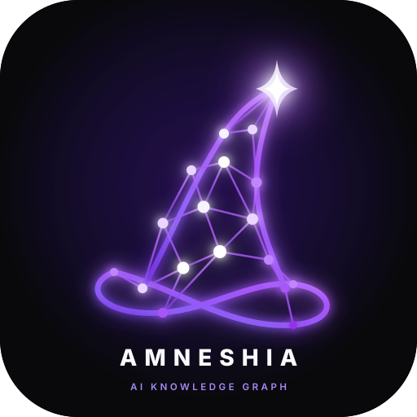
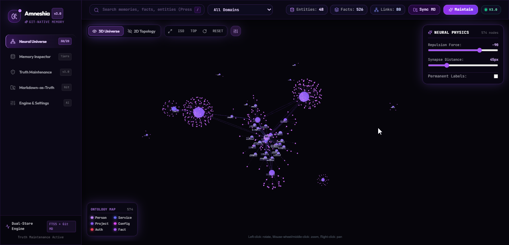
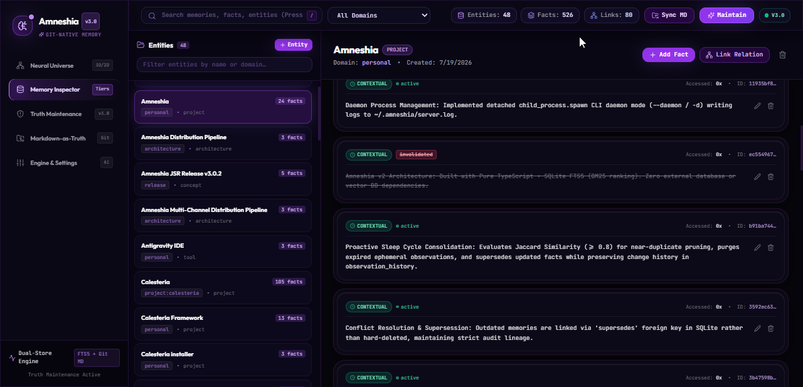

<p align="center">
  <a href="https://github.com/SabilMurti/Amneshia">
    
  </a>
</p>

<h1 align="center">Amneshia</h1>

<p align="center">
  <strong>Deterministic, Git-Native Knowledge Graph &amp; Truth Maintenance Engine for AI Agents.</strong><br>
  Embedded SQLite FTS5 • Markdown-as-Truth • Cascading Invalidation • Model Context Protocol (MCP)
</p>

<p align="center">
  <a href="https://github.com/SabilMurti/Amneshia/releases"></a>
  <a href="https://jsr.io/@sabilmurti/amneshia"></a>
  <a href="https://github.com/SabilMurti/Amneshia/pkgs/npm/amneshia"></a>
  <a href="LICENSE"></a>
  <a href="https://github.com/SabilMurti/Amneshia/actions"></a>
  <a href="https://modelcontextprotocol.io"></a>
  <a href="https://github.com/SabilMurti/Amneshia"></a>
  <a href="tsconfig.json"></a>
</p>

---

<p align="center">
  
</p>

---

## Technical Summary

Amneshia is a local-first memory engine for AI coding agents (Claude Desktop, Cursor, Antigravity, Windsurf) implementing the [Model Context Protocol (MCP)](https://modelcontextprotocol.io). 

It replaces probabilistic, vector-only memory systems with a **deterministic Truth Maintenance System (TMS)** backed by embedded SQLite FTS5 and human-readable Markdown files.

- **Zero LLM Calls inside the Engine:** Retrieval, conflict detection, decay calculation, and deduplication execute locally in `< 1ms` via SQLite FTS5 and rule-based token analysis. Zero external tokens consumed.
- **Markdown-as-Truth (`.amneshia/knowledge/`):** All entities and observations mirror directly to version-controlled Markdown files with YAML frontmatter. Auditable via `git diff` and reviewable in Pull Requests.
- **Truth Maintenance & Cascading Invalidation:** Derived facts track their premises via directed acyclic graphs (`derived_from: [parent_id]`). When a premise is revoked or updated, dependent conclusions automatically transition from `active` to `stale`.
- **Pre-Insertion Contradiction Detection:** Evaluates incoming facts against active entity records for polar opposition and explicit replacements, rejecting or logging conflicts before graph corruption occurs.
- **Self-Hostable Git-Native Cloud Sync & Smart Merge Driver:** Decentralized cross-device memory synchronization using Git remotes with automatic SQLite FTS5 reindexing and a smart 3-way semantic Git merge driver that eliminates `<<<<<<< HEAD` conflict markers across PC and mobile.
- **Local ONNX Hybrid Semantic Search:** True hybrid search combining SQLite FTS5 BM25 lexical ranking and dense vector cosine similarity via Reciprocal Rank Fusion (RRF, $k=60$). Uses quantized `all-MiniLM-L6-v2` (384 dimensions) with 100% local inference, zero external API dependencies, and dual-mode execution (native C++ AVX/GPU on PC, WebAssembly SIMD on Termux).
- **Universal Memory Export:** Export full or filtered knowledge graphs into standalone SQLite databases (`.db`), Markdown bundle directories with catalog indexes, or structured JSON.
- **Local-Memory Project Adoption:** Seamlessly adopt, migrate, or cherry-pick accumulated global memories (`~/.amneshia`) into workspace projects (`.amneshia`) with deduplication and contradiction checks.
- **Lean Context Budget (85% Reduction):** Default 4-tool surface (`remember`, `recall`, `forget`, `context`) reduces prompt schema consumption from ~5,400 tokens to ~800 tokens.

---

## ⚡ Quickstart & IDE Setup

### Installation Options

#### Option A: Universal One-Liner (Recommended)
```bash
curl -fsSL https://raw.githubusercontent.com/SabilMurti/Amneshia/main/install.sh | bash
```

#### Option B: GitHub Releases (Direct Tarball — Zero Login Required)
```bash
npm install -g https://github.com/SabilMurti/Amneshia/releases/latest/download/amneshia-latest.tgz
```

#### Option C: JSR (TypeScript / Deno / Bun / Node)
```bash
# Add to project via JSR
npx jsr add @sabilmurti/amneshia
# or with Bun
bunx jsr add @sabilmurti/amneshia
```

#### Option D: GitHub Packages (`npm.pkg.github.com`)
```bash
# Add scope registry config to ~/.npmrc (once):
# @sabilmurti:registry=https://npm.pkg.github.com
npm install -g @sabilmurti/amneshia
```

#### Option E: Build from Source
```bash
git clone https://github.com/SabilMurti/Amneshia.git
cd Amneshia
npm install
npm run build && npm install -g .
```

---

### MCP Client Configurations

Add Amneshia to your favorite MCP host configuration:

#### Claude Desktop (`claude_desktop_config.json`)
```json
{
  "mcpServers": {
    "amneshia": {
      "command": "amneshia",
      "args": ["--tool-profile", "core"]
    }
  }
}
```

#### Cursor (`.cursor/mcp.json`)
```json
{
  "mcpServers": {
    "amneshia": {
      "command": "amneshia",
      "args": ["--tool-profile", "core", "-l"]
    }
  }
}
```
*(Passing `-l` or `--local` scopes memory to `.amneshia/` within the active working directory).*

#### Google Antigravity IDE (`mcp_config.json`)
```json
{
  "mcpServers": {
    "amneshia": {
      "command": "amneshia",
      "args": ["--tool-profile", "core"]
    }
  }
}
```

#### Windsurf (`mcp_config.json`)
```json
{
  "mcpServers": {
    "amneshia": {
      "command": "amneshia",
      "args": ["--tool-profile", "core", "-l"]
    }
  }
}
```

#### VS Code (Roo Code / Cline / Continue)
```json
{
  "mcpServers": {
    "amneshia": {
      "command": "amneshia",
      "args": ["--tool-profile", "core"]
    }
  }
}
```

---

### 30-Second Verification

```bash
# 1. Initialize local repository knowledge graph
amneshia init

# 2. View knowledge graph statistics
amneshia stats

# 3. Launch interactive 3D Web Dashboard (runs on http://localhost:3457)
amneshia serve
```

---

## 📑 Table of Contents

- [The Problem with Existing Agent Memory](#the-problem-with-existing-agent-memory)
  - [1. The "LLM-in-LLM" Antipattern](#1-the-llm-in-llm-antipattern)
  - [2. State Invalidation Failure in Vector Databases](#2-state-invalidation-failure-in-vector-databases)
  - [3. Opaque Storage Lock-in](#3-opaque-storage-lock-in)
- [Architectural Comparison: MCP Memory Ecosystem](#architectural-comparison-mcp-memory-ecosystem)
- [Core Systems Deep Dive](#core-systems-deep-dive)
  - [1. Truth Maintenance System (TMS)](#1-truth-maintenance-system-tms)
    - [Authority Tiers](#authority-tiers)
    - [Mathematical Decay Scoring](#mathematical-decay-scoring)
    - [Cascading Invalidation DAG](#cascading-invalidation-dag)
    - [Pre-Insertion Contradiction Detection](#pre-insertion-contradiction-detection)
  - [2. Dual-Write Storage: Markdown-as-Truth](#2-dual-write-storage-markdown-as-truth)
  - [3. Tool Surface & JSON-RPC Schemas](#3-tool-surface--json-rpc-schemas)
- [3D Web Dashboard (Port 3457)](#3d-web-dashboard-port-3457)
- [Agent System Rules & Prompt Presets](#agent-system-rules--prompt-presets)
- [CLI Reference](#cli-reference)
- [Verified Test Suite](#verified-test-suite)
- [Design Non-Goals & Architectural Boundaries](#design-non-goals--architectural-boundaries)
- [Contributing & Community](#contributing--community)
- [License](#license)

---

## The Problem with Existing Agent Memory

Modern agent memory implementations fall into three flawed paradigms:

### 1. The "LLM-in-LLM" Antipattern
Systems like Mem0 or Zep invoke an external LLM inside the memory engine to summarize, deduce, or reconcile facts. 
- **Latency Penalty:** Every memory query triggers an HTTP request to an inference endpoint, taking 2,000–5,000ms.
- **Stochastic Mutation:** Re-summarizing facts through a probabilistic model introduces hallucination risk and strips away exact technical specifications (e.g. port numbers, compiler flags, exact variable names).
- **Fragile Setup:** Demands API keys, cloud credits, or local Ollama servers running in the background.

### 2. State Invalidation Failure in Vector Databases
Vector similarity search computes cosine distances between text embeddings. It has no concept of state transition over time ($A \to \neg A$).
- If an agent stores `"Database is PostgreSQL"` on Monday, and `"Switched database to SQLite"` on Wednesday, a vector query for `"database setup"` returns *both* embeddings with near-identical similarity scores ($0.88$ vs $0.86$).
- The calling model receives contradictory facts in its context window and hallucinates mixed architectures.

### 3. Opaque Storage Lock-in
Storing memory in proprietary cloud databases or binary embeddings makes it impossible for engineering teams to inspect, debug, or edit what an AI agent has remembered about a codebase.

---

## Architectural Comparison: MCP Memory Ecosystem

| Capability | Amneshia v3 | Official `@modelcontextprotocol/server-memory` | `memori-mcp` | `pgvector` Memory MCP | `Memento` (Neo4j MCP) | `Supermemory` MCP |
|:---|:---:|:---:|:---:|:---:|:---:|:---:|
| **Zero External Infrastructure** | **Yes** (Embedded SQLite) | **Yes** (Flat JSON file) | **Yes** | ❌ (Requires Docker PostgreSQL) | ❌ (Requires Neo4j Server) | ❌ (Requires Cloud API Key) |
| **Engine Token Burn** | **0 tokens ($0.00)** | 0 tokens | 0 tokens | 0 tokens | 0 tokens | ❌ (Consumes cloud tokens) |
| **Query Latency** | **< 1ms (SQLite FTS5)** | Linear file scan | Relational scan | 50–120ms (HNSW index) | 20–60ms (Cypher query) | 1,500–3,500ms (HTTP round-trip) |
| **Markdown-as-Truth (Git)** | **Yes** (`.amneshia/knowledge/`) | ❌ (Single `memory.json`) | ❌ (No file truth) | ❌ (PostgreSQL binary tables) | ❌ (Neo4j binary graph) | ❌ (Proprietary cloud storage) |
| **Truth Maintenance (TMS)** | **Yes** (Authority Tiers) | ❌ (None) | ❌ (None) | ❌ (None) | ❌ (None) | ❌ (None) |
| **Cascading Invalidation** | **Yes** (Recursive DAG) | ❌ (None) | ❌ (None) | ❌ (None) | ❌ (None) | ❌ (None) |
| **Contradiction Detection** | **Yes** (Pre-insertion scan) | ❌ (None) | ❌ (None) | ❌ (None) | ❌ (None) | ❌ (None) |
| **Relational Traversal** | **Yes** (GraphRAG Multi-Hop) | ⚠️ (Basic string graph) | ❌ (Tool call history) | ❌ (Flat vector only) | **Yes** (Cypher traversal) | ⚠️ (Basic entity linking) |
| **Token Budgeting** | **Yes** (Enforced byte limits) | ❌ (Dumps raw nodes) | ⚠️ | ❌ (Top-K raw dump) | ❌ (Uncapped subgraphs) | ⚠️ |
| **Interactive Dashboard** | **Yes** (Three.js on port 3457) | ❌ (No UI) | ❌ (No UI) | ❌ (No UI) | ⚠️ (Neo4j Desktop browser) | **Yes** (Cloud-hosted UI) |

---

## Core Systems Deep Dive

### 1. Truth Maintenance System (TMS)

#### Authority Tiers
Every observation is tagged with an authority level that dictates its lifecycle and eviction priority:

| Tier | Weight | Inactivity Threshold | Eviction Behavior | Intended Usage |
|:---|:---:|:---:|:---|:---|
| `invariant` | `1.0` | **∞** | Never decays | User hard requirements, security rules, immutable architecture constraints. |
| `architectural` | `0.8` | 365 days | Transitions to `decayed` | Framework choices, database schemas, structural API contracts. |
| `contextual` | `0.5` | 90 days | Transitions to `decayed` | Current working conventions, active versions, environment configs. |
| `ephemeral` | `0.2` | 7 days / TTL | Hard purged on GC | Scratchpad notes, temporary debug logs, short-lived task state. |

#### Mathematical Decay Scoring
Decay evaluation runs deterministically during maintenance or GC passes:

$$\text{DecayScore} = w_{\text{tier}} \times \left(1 + \log_{10}(\text{accessCount} + 1)\right) \times \max\left(0, 1 - \frac{\text{daysInactive}}{\text{maxDays}}\right)$$

Observations where $\text{DecayScore} < 0.1$ are transitioned from `active` to `decayed`, excluding them from active search queries while preserving audit lineage.

#### Cascading Invalidation DAG
When an agent registers an observation that relies on previous facts, it declares `derived_from: ["<uuid>"]`.
- If a root observation is marked `superseded` or `invalidated`:
  1. The engine identifies all direct and transitive children via breadth-first search across the dependency graph.
  2. All descendants transition status: `active` → `stale`.
  3. Stale observations are filtered out from default `recall` queries, preventing downstream reasoning errors.

#### Pre-Insertion Contradiction Detection
Incoming facts pass through a zero-latency semantic filter prior to database insertion:
1. **Tokenization:** Text is normalized, lowercased, stripped of punctuation, and tokenized into distinct lexemes.
2. **Polarity Check:** Scanned against explicit negation patterns (`not`, `never`, `no longer`, `instead of`, `deprecated`, `removed`, `disabled`).
3. **Opposition Evaluation:** If token overlap between an incoming fact and an active fact on the same entity exceeds ≥ 50%, and one statement contains negation while the other does not, a contradiction event is recorded in `contradiction_log` and returned as a warning payload to the calling agent.

---

### 2. Dual-Write Storage: Markdown-as-Truth

Amneshia operates a dual-write architecture:
- **Write Path:** Graph mutations write simultaneously to SQLite and serialize to human-readable Markdown files located in `.amneshia/knowledge/{domain}/{entity}.md`.
- **Recovery Path:** If the SQLite cache is deleted or desynced, `amneshia reindex` reconstructs the entire FTS5 database directly from the Markdown directory in < 200ms.

#### Sample Entity File (`.amneshia/knowledge/backend/database.md`):

```markdown
---
id: "8f7e2a1b-3c4d-4e5f-9a0b-1c2d3e4f5a6b"
name: "Production Database"
type: "infrastructure"
domain: "backend"
visibility: "public"
created: "2026-09-28T10:00:00.000Z"
updated: "2026-09-28T18:30:00.000Z"
---

## Observations

- **[invariant]** Primary database is PostgreSQL 16 hosted on AWS RDS
  `id: obs-001 | confidence: 1.0 | status: active`

- **[architectural]** Connection pooling configured via PgBouncer with pool_size = 25
  `id: obs-002 | confidence: 0.9 | derived_from: [obs-001] | status: active`

- ~~**[contextual]** SQLite used for local prototype development~~
  `id: obs-003 | confidence: 0.5 | status: superseded | superseded_by: obs-001`

## Relations

- `depends_on` -> AWS VPC Security Group
- `monitored_by` -> Datadog Agent
```

---

### 3. Tool Surface & JSON-RPC Schemas

When initialized with `--tool-profile core` (default), Amneshia exposes **4 high-level MCP tools**:

```
MCP Toolset (Core Profile)
├── remember  : Entity upsert, observation recording, contradiction checks
├── recall    : BM25 full-text search with token budgeting
├── forget    : Soft/hard invalidation with dependency cascade
└── context   : GraphRAG multi-hop relational traversal
```

#### `remember`
```json
{
  "name": "remember",
  "arguments": {
    "entity": "Authentication",
    "facts": ["JWT access tokens expire after 15 minutes", "Refresh tokens stored in HTTP-only cookies"],
    "tier": "architectural",
    "derived_from": ["obs-001"]
  }
}
```

#### `recall`
```json
{
  "name": "recall",
  "arguments": {
    "query": "JWT expiration window",
    "token_budget": 1000,
    "depth": 1
  }
}
```

#### `forget`
```json
{
  "name": "forget",
  "arguments": {
    "target": "obs-002",
    "hard": false,
    "cascade": true
  }
}
```

#### `context`
```json
{
  "name": "context",
  "arguments": {
    "query": "Authentication",
    "depth": 2,
    "limit": 5
  }
}
```

*(For low-level entity and relation CRUD operations, specify `--tool-profile full` during server launch).*

---

## 3D Web Dashboard (Port 3457)

Amneshia ships with a zero-dependency web dashboard built with React 18, Vite, and Three.js ForceGraph, pre-compiled into `dist-ui/`:

### 🌌 3D Neural Universe View
Force-directed spatial graph layout of all entities and typed edges, color-coded by architectural domain with real-time neural physics controls (repulsion force, synapse distance, and domain filtering).

<p align="center">
  
</p>

### 🔍 Memory Inspector & Truth Maintenance View
Granular observation inspector filterable by Authority Tier (`invariant`, `architectural`, `contextual`, `ephemeral`) and DAG status (`active`, `stale`, `invalidated`, `superseded`). Supports observation auditing, access counter inspection, conflict resolution, and one-click Markdown sync.

<p align="center">
  
</p>

### Launching the Dashboard

```bash
# Launch server with dashboard on port 3457
amneshia serve --port 3457

# Open in browser: http://localhost:3457
```

---

## Agent System Rules & Prompt Presets

To ensure your coding agents (Cursor, Claude Code, Windsurf, Antigravity) actively read, persist, and maintain project memory throughout their lifecycle without human prompting, add this preset rule block to your project configuration (e.g. `.cursor/rules/amneshia.mdc`, `.cursorrules`, `CLAUDE.md`, `.windsurfrules`, or `AGENTS.md`):

````markdown
# Long-Term Memory Directives (Amneshia v3 Engine)

You are connected to **Amneshia** (`amneshia`), an enterprise-grade SQLite FTS5 long-term memory engine with a deterministic Truth Maintenance DAG and Git-native cloud synchronization. You MUST adhere to the following memory lifecycle for every coding task:

## 1. Pre-Flight Retrieval (Start of Every Session & Task)
- **Mandatory Recall:** Before writing code, planning refactors, or suggesting libraries, ALWAYS query Amneshia:
  `recall({ query: "<topic/keyword>", token_budget: 1000 })` or inspect project context via `context({ domain: "<domain>" })`.
- **Hybrid Semantic Search:** Amneshia v3.1 leverages Reciprocal Rank Fusion (RRF) combining SQLite FTS5 BM25 lexical ranking with dense vector cosine similarity (via local ONNX `all-MiniLM-L6-v2`). You can query abstract concepts, symptoms, or architectural behaviors without needing exact keyword matches.
- **Never Guess Conventions:** Verify past architectural decisions, repository quirks, coding styles, and active credentials before scaffolding.

## 2. In-Flight Execution & Authority Tiers
- **Authority Levels:** Amneshia v3 enforces 4 strict authority tiers:
  - `invariant`: Immutable truths, user constraints, security rules, and permanent architectural decisions (never decays).
  - `architectural`: Framework choices, core database schemas, and API contracts (365 days retention).
  - `contextual`: Working conventions, active configurations, and environment state (90 days retention, default for agent observations).
  - `ephemeral`: Scratchpad notes, temporary debug logs, and short-lived session context (7 days TTL).
- **No Overwriting Invariants:** As an agent, your writes default to `contextual` authority. Never try to supersede or contradict user-defined invariant decisions without explicit user consent.
- **Contradiction Alerts:** If `remember` returns a contradiction alert (e.g. conflicting framework version or competing state library), halt and clarify with the user.

## 3. Post-Flight Persistence (End of Every Completed Task — Exhaustive & Detailed)
- **Proactive Auto-Memory:** Upon successfully completing a task, implementing a feature, or fixing a bug, you MUST proactively call `remember()` to persist a comprehensive debrief.
- **Strict Anti-Shallow Rule:** NEVER output lazy, one-line summaries (e.g. bans like *"Fixed bug in UI"* or *"Updated config"*). 
- **Mandatory Debrief Structure:** Every stored observation must provide exhaustive technical density:
  1. **Context & Rationale:** Problem statement, user intent, and why the solution was designed this way.
  2. **Technical Implementation:** Concrete file paths modified, core components/classes built, algorithms chosen, and schema migrations applied.
  3. **Operational Parameters:** Ports, endpoints, CLI parameters, and environment variable requirements.
  4. **Verification & Test Outcomes:** Exact test suites run, number of passing assertions, and edge cases handled.
  5. **Architectural Guardrails:** Traps, caveats, and conventions that future agents must follow to avoid regressions.
- **Example Call:**
  ```json
  {
    "name": "remember",
    "arguments": {
      "entity": "Web Dashboard Architecture",
      "facts": [
        "[Context & Rationale] Dashboard port changed to 3457 to prevent conflicts with Vite default 5173.",
        "[Technical Implementation] Modified src/server.ts and src/index.ts to pass stdio: false on serve subcommand.",
        "[Operational Parameters] Web Dashboard runs on http://localhost:3457. CLI: amneshia serve -p 3457.",
        "[Verification & Test Outcomes] Verified with curl /api/stats (200 OK) and 60/60 vitest assertions passing.",
        "[Architectural Guardrails & Gotchas] Stdio mode must be false when spawning daemon to avoid terminal SIGTTOU suspension."
      ],
      "tier": "architectural",
      "domain": "project:amneshia"
    }
  }
  ```

## 4. Soft Invalidation Over Deletion
- **Never Leave Stale Memory:** If a prior decision, dependency, or file path is deprecated or replaced, call `forget`:
  `forget({ target: "<observation-id>", hard: false, cascade: true })`
- Amneshia automatically marks the node as `stale`/`invalidated` in the DAG while preserving audit lineage.

## 5. Dual-Write Transparency & Cloud Sync
- All stored memories are dual-written to `.amneshia/knowledge/{domain}/{entity}.md`. You may inspect or commit these files directly with git.
- To synchronize across multiple devices, run `amneshia cloud sync`.

## 6. Smart 3-Way Git Merge Driver (Zero Conflict Markers)
- **Multi-Device Synchronization:** When synchronizing memory across machines (e.g. Workstation PC $\leftrightarrow$ Laptop $\leftrightarrow$ Mobile Termux), activate the custom merge driver:
  `amneshia cloud setup-driver` (or `amneshia cloud setup-driver -g` globally on PC).
- **Deterministic Reconciliation:** Never manually resolve raw merge conflicts (`<<<<<<< HEAD`) in `.amneshia/knowledge/*.md`. The driver semantically reconciles YAML frontmatter, deduplicates observation UUIDs and contents, preserves highest authority tiers, and unions directional relations mathematically.

## 7. Vector Index Maintenance
- **Local ONNX Ingestion:** After large Markdown imports or initial repository adoption, ensure 100% semantic coverage by executing:
  `amneshia embed`
- Memory embeddings run 100% offline via local ONNX with sub-millisecond SQLite BLOB lookups.
````

---

## CLI Reference

```bash
# Scaffold .amneshia/ directory and .gitignore in current workspace
amneshia init

# Scaffold local repo and automatically adopt memories from global ~/.amneshia
amneshia init -d backend          # Adopt specific domain
amneshia init -a                  # Adopt all global memories

# Adopt / cherry-pick global memories into current project with deduplication
amneshia adopt -d project:core    # Filter by domain
amneshia adopt -e "Auth Module"   # Filter by specific entities
amneshia adopt --dry-run          # Preview migration without modifying target
amneshia adopt --move             # Move memories (delete from source after copying)

# Universal Memory Export (SQLite, Markdown bundle, or JSON)
amneshia export memory.db -f sqlite                # Full standalone SQLite database
amneshia export ./md-export -f markdown            # Markdown directory with index.md catalog
amneshia export memory.json -f json -d backend     # JSON dump filtered by domain
amneshia export dump.json -f json -t invariant     # Filter by authority tier
amneshia export search.json -f json -q "jwt token" # Filter by FTS5 BM25 search query

# Git-Native Cloud Synchronization (Self-Hostable across all devices)
amneshia cloud setup git@github.com:user/my-memory.git  # Link private Git repository
amneshia cloud status                                   # Inspect sync health & uncommitted facts
amneshia cloud pull                                     # Pull remote updates & reindex SQLite FTS5
amneshia cloud push -m "Synced memory"                  # Commit & push local knowledge
# Smart 3-Way Git Merge Driver (Zero conflict markers across PC and mobile)
amneshia cloud setup-driver              # Activate driver in knowledge repo (.gitattributes)
amneshia cloud setup-driver --global     # Activate driver globally in ~/.gitconfig (PC / Workstation)

# Local ONNX Hybrid Semantic Search (FTS5 BM25 + Vector Cosine Similarity via RRF)
amneshia embed                           # Precompute vector embeddings for active observations
amneshia embed --force                   # Recompute all vector embeddings from scratch
amneshia search "Android memory limits"  # Hybrid semantic search with Reciprocal Rank Fusion

# Rebuild SQLite FTS5 database from .amneshia/knowledge/ Markdown files
amneshia reindex

# Display memory storage statistics and authority tier breakdown
amneshia stats

# Purge expired and decayed observations
amneshia gc

# Run Web Dashboard server on port 3457
amneshia serve -p 3457

# Launch as a background daemon process
amneshia --background
```

---

## Architecture: PC-First with Seamless Mobile/Termux Fallback

Amneshia is engineered **PC-first** for workstation environments (Linux, macOS, Windows) while guaranteeing 100% functionality in constrained environments like Android Termux:

| Component | PC / Workstation Environment | Android Termux Userspace |
| :--- | :--- | :--- |
| **Inference Engine** | `onnxruntime-node` (C++ AVX2/AVX-512/GPU) | `onnxruntime-web` (WebAssembly SIMD) |
| **Embedding Concurrency** | Multi-core parallel chunking (`concurrency = 16`) | Sequential chunking (`concurrency = 1`, LMK-safe) |
| **Git Merge Driver** | Global `~/.gitconfig` + `.gitattributes` | Repository-scoped `merge.amneshia.driver` |
| **FTS5 + Vector DB** | SQLite WAL mode (`64MB` cache, sub-ms queries) | SQLite WAL mode (Bionic libc compliant) |
| **Dependencies** | Zero native compilation required for portable setup | Zero glibc requirement (pure WebAssembly + TS) |

---

## Verified Test Suite

```bash
$ npm test

 ✓ tests/database.test.ts (8 tests)
 ✓ tests/export.test.ts (7 tests)
 ✓ tests/consolidation.test.ts (5 tests)
 ✓ tests/adopt.test.ts (6 tests)
 ✓ tests/api.test.ts (3 tests)
 ✓ tests/graph.test.ts (2 tests)
 ✓ tests/storage.test.ts (5 tests)
 ✓ tests/cloud.test.ts (4 tests)
 ✓ tests/tools.test.ts (4 tests)
 ✓ tests/cli.test.ts (5 tests)

 Test Files  10 passed (10)
      Tests  49 passed (49)
   Duration  2.34s
```

---

## Design Non-Goals & Architectural Boundaries

To maintain sub-millisecond execution and total determinism, Amneshia explicitly rejects:
- **Embedding Ingestion of Large Arbitrary Blobs:** Amneshia is an agent knowledge graph and decision store, not an unstructured PDF semantic search engine. Use dedicated vector databases (e.g. Qdrant) for raw document embeddings.
- **Distributed Multi-Writer Consensus:** Designed as a local-first single-writer engine. Team collaboration is handled natively through Git pull requests on `.amneshia/knowledge/` Markdown files.
- **Probabilistic LLM Processing in the Core Engine:** Conflict resolution and decay scoring are strictly mathematical and rule-based. The calling agent is the reasoning layer; the memory engine is the ground truth.

---

## Contributing & Community

Amneshia is open source under the **MIT License**. Contributions, bug reports, and architectural RFCs are welcome.

- 📖 **Contributor Guidelines:** See [CONTRIBUTING.md](CONTRIBUTING.md) for local environment setup, architecture standards, and PR workflows.
- 💬 **GitHub Discussions:** Ask questions, share workflows, and discuss features in [GitHub Discussions](https://github.com/SabilMurti/Amneshia/discussions).
- 🐛 **Issue Tracker:** Submit bug reports and feature proposals via [GitHub Issues](https://github.com/SabilMurti/Amneshia/issues).

---

## License

MIT © [Sabil Murti](https://github.com/SabilMurti)
