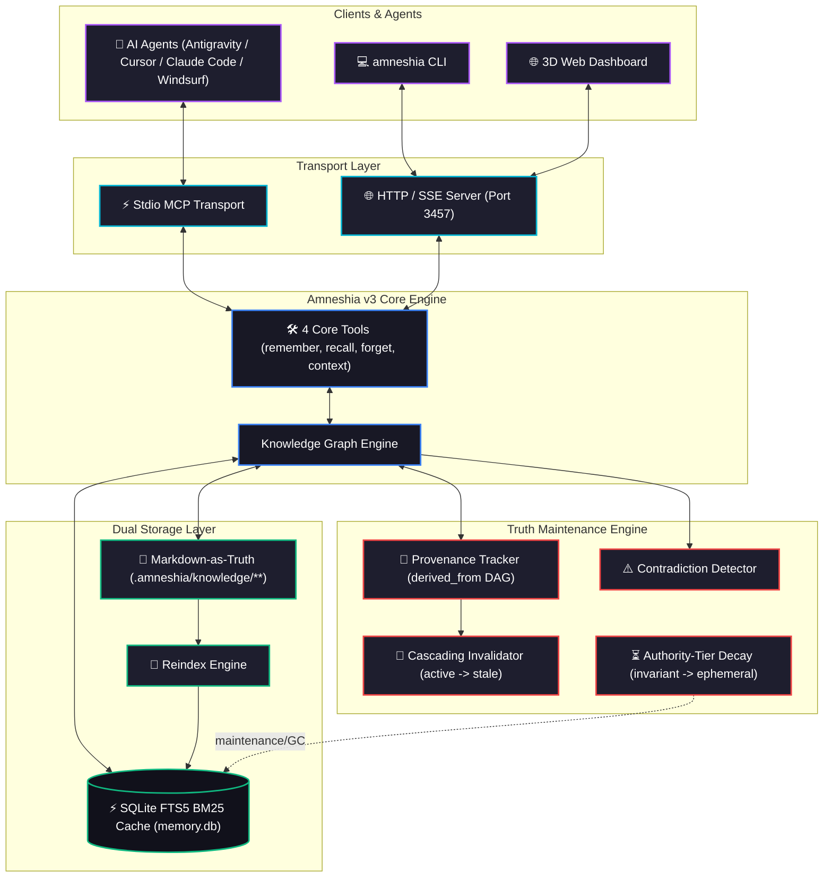

# Amneshia

[](https://github.com/SabilMurti/Amneshia/releases)
[](LICENSE)
[](https://github.com/SabilMurti/Amneshia/actions)

> **The memory system that knows when it's wrong.**  
> Git-native knowledge graph for AI agents with truth maintenance, Markdown-as-truth, provenance tracking, and cascading invalidation.  
> Zero external databases. Zero API keys required. Zero config.

---

## Why Amneshia v3?

Most agent memory tools are either flat key-value text blobs or centralized vector databases that hallucinate outdated conclusions when underlying facts change.

Amneshia v3 is built on 5 fundamental pillars:
1. **Markdown-as-Truth & Git-Native**: Your knowledge graph lives in readable `.amneshia/knowledge/{domain}/{entity}.md` files with YAML frontmatter. Check memories into Git, review them in PRs, and `git diff` what your agent knows.
2. **Truth Maintenance & Cascading Invalidation**: Every derived conclusion tracks what it depends on (`derived_from`). When a base premise is disproven or updated, derived facts are automatically flagged as `stale` across the DAG.
3. **Pre-Insertion Contradiction Detection**: Detects polar conflicts before storing contradictory facts, preventing memory corruption.
4. **Authority-Tier Value Decay**: Invariant facts never decay; architectural decisions decay after 365 days of inactivity; contextual facts decay after 90 days; ephemeral notes decay after 7 days.
5. **Ultra-Lean Context Window (4 Core Tools)**: Default `--tool-profile core` cuts schema footprint by **85%** (~800 tokens vs 5,000+), leaving your model's context window open for actual work.

---

## Why Amneshia v3 vs Other MCP Memory Servers?

Most developers looking for long-term memory in Claude Desktop, Cursor, or Windsurf are forced to choose between **naive reference implementations** (like `@modelcontextprotocol/server-memory` that dump everything into a fragile `memory.json`), **heavy database servers** (PostgreSQL/pgvector or Neo4j requiring Docker containers), or **cloud SaaS wrappers** (burning tokens and sending private code to third-party servers).

Amneshia v3 is the **gold-standard local-first memory engine**:

| Capability | Amneshia v3 | Official MCP `server-memory` | `memori-mcp` | `pgvector` Memory MCP | `Memento` (Neo4j MCP) | `Supermemory` MCP |
|:---|:---:|:---:|:---:|:---:|:---:|:---:|
| **Zero External DB / Zero Setup** | **YES** (Embedded SQLite) | **YES** (Flat JSON file) | **YES** | ❌ (Requires Docker Postgres) | ❌ (Requires Neo4j Server) | ❌ (Requires Cloud API Key) |
| **100% Local & Zero Token Cost** | **YES** (0 LLM token burn) | **YES** | **YES** | **YES** | **YES** | ❌ (Cloud token usage) |
| **Sub-Millisecond Search** | **YES** (<1ms FTS5 BM25) | ❌ (Slow linear scan) | ❌ (Relational scan) | ❌ (50–100ms vector index) | ❌ (Cypher query overhead) | ❌ (Network API latency) |
| **Markdown-as-Truth & Git-Native** | **YES** (`.amneshia/knowledge/`) | ❌ (Single `memory.json`) | ❌ (No file truth) | ❌ (Postgres binary tables) | ❌ (Neo4j graph db) | ❌ (Proprietary cloud DB) |
| **Truth Maintenance System (TMS)** | **YES** (4 Authority Tiers) | ❌ (None) | ❌ (None) | ❌ (None) | ❌ (None) | ❌ (None) |
| **Cascading Invalidation** | **YES** (`derived_from` DAG) | ❌ (None) | ❌ (None) | ❌ (None) | ❌ (None) | ❌ (None) |
| **Pre-Insertion Conflict Detection**| **YES** (Rule-based) | ❌ (None) | ❌ (None) | ❌ (None) | ❌ (None) | ❌ (None) |
| **GraphRAG Multi-Hop Traversal** | **YES** (Typed relations) | ⚠️ (Basic string graph) | ❌ (Tool call history) | ❌ (Flat vector only) | **YES** (Graph traversal) | ⚠️ (Basic links) |
| **Token Budgeting & Lean Context** | **YES** (85% reduction, 4 tools) | ❌ (Dumps entire nodes) | ⚠️ | ❌ (Top-K raw dump) | ❌ (Uncapped subgraph) | ⚠️ |
| **Interactive 3D Web Dashboard** | **YES** (Three.js on port 3457) | ❌ (No UI) | ❌ (No UI) | ❌ (No UI) | ⚠️ (External Neo4j app) | **YES** (Cloud-only web app) |

---

## Architecture Diagram (v3)



---

## 4 Core Tools Overview

When connecting an agent, Amneshia exposes **4 high-level tools** by default:

### 1. `remember`
Stores facts for an entity. Automatically creates entities, assigns authority tiers, records logical dependencies, and flags contradictions:
```json
{
  "entity": "Database Architecture",
  "facts": ["We use PostgreSQL for our primary application database"],
  "tier": "invariant"
}
```
*Subsequent derived facts can reference previous facts:*
```json
{
  "entity": "Database Architecture",
  "facts": ["PgBouncer connection pool configured with size 25"],
  "tier": "architectural",
  "derived_from": ["<observation-uuid-of-postgres-fact>"]
}
```

### 2. `recall`
Intelligent search with strict token budgeting and progressive disclosure:
```json
{
  "query": "PostgreSQL database configuration",
  "token_budget": 1500,
  "depth": 1
}
```

### 3. `forget`
Targeted removal. Supports soft invalidation (default) or hard permanent delete, with cascading invalidation of derived downstream facts:
```json
{
  "target": "<observation-uuid-or-entity-name>",
  "hard": false,
  "cascade": true
}
```

### 4. `context`
High-speed GraphRAG multi-hop relational retrieval:
```json
{
  "query": "Authentication flow",
  "depth": 2,
  "limit": 5
}
```

*(Need granular tools? Run with `--tool-profile full` to expose all 12 tools including entity/relation CRUD and graph inspection).*

---

## Markdown-as-Truth Format

Each entity is serialized to a clean markdown document inside `.amneshia/knowledge/{domain}/{slug}.md`:

```markdown
---
id: "8f7e2a1b-..."
name: "React Architecture"
type: "concept"
domain: "project:frontend"
visibility: "public"
allowed_agents: []
created: "2026-09-28T10:00:00.000Z"
updated: "2026-09-28T12:00:00.000Z"
---

## Observations

- **[architectural]** Uses Next.js App Router for server rendering
  `id: obs-001 | confidence: 1.0 | status: active`

- **[contextual]** Configured Tailwind CSS with custom theme
  `id: obs-002 | confidence: 0.9 | derived_from: [obs-001] | status: active`

- ~~**[contextual]** Legacy CSS modules~~
  `id: obs-003 | confidence: 0.5 | status: superseded | superseded_by: obs-002`

## Relations

- `deployed_on` -> Vercel Deployment
```

---

## Authority Tiers & Value-Based Decay

| Tier | Weight | Max Inactivity | Decay Action | Example |
|:---|:---:|:---:|:---:|:---|
| `invariant` | 1.0 | **Never** | None (Never decays) | "User prefers dark mode", "Never use eval()" |
| `architectural` | 0.8 | 365 days | Status -> `decayed` | "Database is PostgreSQL", "Auth via Supabase" |
| `contextual` | 0.5 | 90 days | Status -> `decayed` | "Using React 19.1", "Last deploy Sept 2026" |
| `ephemeral` | 0.2 | 7 days / expiry | Hard purge | "Debugging issue #42 this afternoon" |

---

## Quick Start & CLI

### Installation

```bash
# Global install directly from GitHub:
npm install -g github:SabilMurti/Amneshia

# Or clone & build from source:
git clone https://github.com/SabilMurti/Amneshia.git
cd Amneshia
npm install
cd dashboard && npm install && npm run build && cd ..
npm run build && npm install -g .
```

### Setup in your IDE (MCP Config)

Add Amneshia to your agent settings (`claude_desktop_config.json`, Antigravity `mcp_config.json`, Cursor, or Windsurf):

```json
{
  "mcpServers": {
    "amneshia": {
      "command": "amneshia",
      "args": ["--tool-profile", "core"]
    }
  }
}
```
*(Note: If running in a repository, add `"-l"` to `"args"` to enable per-repo `.amneshia/` mode).*

### CLI Commands

```bash
# Initialize a local knowledge repository in current directory (.amneshia/)
amneshia init

# Rebuild SQLite FTS5 index from markdown files
amneshia reindex

# Display knowledge graph statistics & authority tier breakdown
amneshia stats

# Garbage collect decayed, expired, and invalidated observations
amneshia gc

# Launch interactive 3D Web Dashboard (Three.js ForceGraph)
amneshia serve --port 3457

# Run in background daemon mode
amneshia --background
```

---

## License

MIT © [Sabil Murti](https://github.com/SabilMurti)
